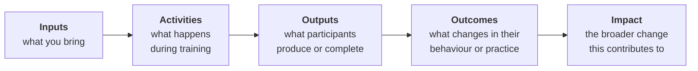
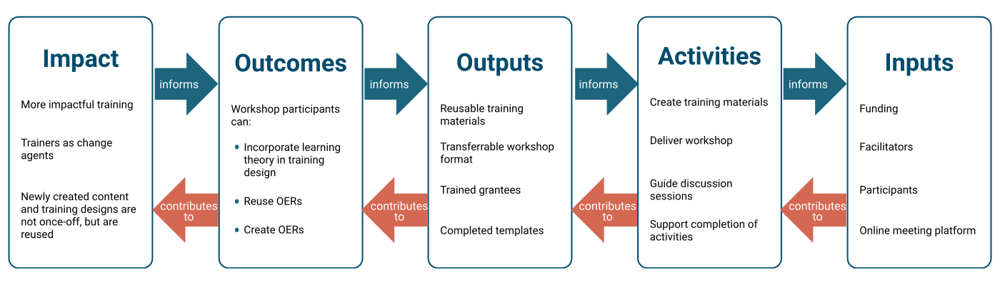

---
learning_outcomes:
  - Describe training as an intervention within a broader system
  - Identify key elements of the system your training operates in (actors, resources, constraints, influences)
  - Articulate a simple theory of change linking activities to outcomes and impact
  - Analyse how context, power, and positionality influence training design and outcomes
  - Identify key assumptions and risks that may affect the success of your training
guiding_questions:
  - What system does your training sit within, and who are the key actors?
  - What change are you trying to contribute to, and how will training support that?
  - What assumptions are you making about how change will happen?
  - What factors outside your control could affect success?
  - How do your role and positionality influence the design and delivery of this training?
---



Picture a workshop you've attended — or one you've run. Now zoom out. Who funded it? What happened before participants arrived? What happened after they left? Did the environment they returned to support or undermine what they learned? And most importantly, did it make a difference?

This lesson is about that bigger picture. Before you design content, activities, or assessments, you need to understand the system your training lives in — and be honest about what training alone can and cannot change.

## Why this matters

It's tempting to start designing training by asking *"What should I teach?"* That question feels productive, but it skips something important: understanding the conditions that will determine whether your training actually leads to change.

Training doesn't happen in a vacuum. It happens inside organisations, communities, and funding structures. Participants arrive with existing knowledge, constraints on their time, and environments that may or may not support what they learn. A perfectly designed workshop can have zero lasting impact if the system around it works against the change you're hoping for.

!!! quote "The real question"
    Not *"What should I teach?"* but *"What change is possible in this system — and how can training contribute?"*

When you understand the system first, you make better design decisions: what to include, what to leave out, how ambitious to be, and where to invest your limited time.

## Understanding your training as part of a system

!!! abstract "Training as an intervention"
    Training is a deliberate action intended to contribute to change — but it only works in relation to the wider system around it.

Training can introduce new knowledge, build skills, create space for practice, or shift how people think about a problem. But whether any of that leads to lasting change depends on factors beyond the training itself: whether learners have time to apply what they learn, whether their institutions support new approaches, whether funding continues, whether the right people are in the room.

This is what it means to think about training as an *intervention in a system* rather than a standalone event. A system, in this context, simply means the web of people, resources, relationships, constraints, and external forces that surround your training. You don't control this system — but you need to understand it well enough to design something that can work within it.

### Mapping your system

The best way to understand your system is to draw it. Start by placing your training at the centre of a simple diagram. Around it, add every person, organisation, or resource that affects whether it succeeds. Draw lines to show relationships — who depends on whom, what flows where.

Look for three things in particular:

- **Clusters** — where several actors depend on the same resource (a single funder, a shared platform, one key coordinator). These are fragile points.
- **Gatekeepers** — people or institutions that sit between your training and its intended impact. A line manager who won't release staff for training. A policy that prevents learners from applying new methods.
- **Missing connections** — actors who should be linked but aren't. If your training produces skilled graduates but nobody connects them to job opportunities, the chain breaks.

!!! warning "A common trap"
    It's easy to map only the people directly involved in delivery — trainers, learners, maybe a funder. But the actors who most affect long-term impact are often further out: the managers learners report to, the communities they serve, the policies they work under. Push your map beyond the obvious.

## From system to theory of change

Once you understand the system, the next question is: *how does your training lead to change within it?*

A Theory of Change is a simple, honest account of the logic connecting what you do to the impact you hope for. It makes your assumptions visible — which is exactly the point. Hidden assumptions are where training designs quietly fail.

The basic structure looks like this:

<!-- This chain is deliberately simplified. Lesson 8 revisits assessment of outcomes in more depth, and Part 2 covers activity design. Here we just need readers to grasp the system-level logic. -->

### Building yours step by step

Start from the right side of the chain, not the left. Begin with the impact you hope to contribute to, then work backwards. This keeps you honest — it's easy to list activities you enjoy delivering, but harder to explain exactly how they lead to real-world change.

For each link in the chain, ask: *What has to be true for this step to lead to the next?* Those are your assumptions. Write them down. For example, if your chain says "participants learn data analysis skills → they apply those skills at work," you're assuming they have access to relevant data, that their managers support new approaches, and that they have time to practice. Each assumption is a potential point of failure.

!!! example "A Theory of Change in action"
    A university team designs a two-day workshop on open research practices for early-career researchers. Their chain: **Inputs** (facilitators, case studies, institutional buy-in) → **Activities** (hands-on sessions with open-access tools) → **Outputs** (participants publish one dataset openly) → **Outcomes** (researchers adopt open practices in their ongoing work) → **Impact** (increased transparency in regional research output).

    Their key assumption? That participants' departments won't penalise them for spending time on open practices instead of traditional publication metrics. When they surface this assumption, they realise they need to involve department heads *before* the workshop — not after.

You'll return to your Theory of Change throughout this workbook — refining it as you define learning outcomes in Lesson 3, design activities in Part 2, and think about assessment in Lesson 8. Treat it as a living document, not a one-off exercise.

## Your role in the system

Training is not neutral. The choices you make as a designer — what to include, whose examples to use, what counts as "good" performance — reflect your position, your background, and your assumptions about what matters.

This isn't a problem to solve; it's a reality to be aware of. Consider the difference between these roles:

| Role | What it looks like | When it fits |
|---|---|---|
| **Instructor** | You set the agenda, deliver content, assess outcomes | When learners need specific technical skills and you have clear expertise |
| **Facilitator** | You guide discussion and create conditions for learning, but participants drive the content | When learners have significant existing knowledge or the topic requires local adaptation |
| **Co-designer** | You build the training *with* participants, not just *for* them | When power dynamics matter, when local context is essential, or when you're an outsider to the community |

Most real training involves a mix of these roles. The key is to choose deliberately rather than defaulting to "instructor" because it's familiar.

!!! question "Pause and reflect"
    Think about a training you've delivered or are planning. What role did you (or would you) naturally take? Who decided the content, the format, the success criteria — and who was left out of those decisions?

## A worked example: climate data training

A team at an environmental research institute is asked to design training on climate data analysis for community organisers across three rural districts. The organisers work for local NGOs and have strong relationships with farming communities, but limited experience with data tools.

The team's first instinct is to build a workshop around the data analysis software they use in their own research. But when they map the system, they discover several things that reshape their design.

First, internet access across the three districts is unreliable. Two of the three locations have no consistent connectivity, which rules out cloud-based tools. Second, the community organisers already collect weather and crop data informally — in notebooks, through conversations, via local observation. This existing knowledge is an asset, not a gap to fill. Third, the organisers' managers expect immediate, practical outputs: tools their teams can use in the field next season, not academic skills that pay off over years.

These discoveries change every design decision. The team shifts from teaching their preferred software to building the workshop around offline-capable tools that integrate with the data collection practices organisers already use. They restructure the agenda so organisers contribute their local data as working material — making the training immediately relevant rather than abstract. And they move from an instructor-led format to a co-design model, recognising that the organisers understand their communities far better than the research team does.

The result is a training programme that participants can apply the day they return to work, and that other districts can adapt without depending on the original team.

Notice what made this work: not better content, but better understanding of the system. The team's expertise in climate data didn't change — but their design decisions improved dramatically once they understood the constraints, resources, and relationships around the training.

## In practice

You've now seen how system mapping and a Theory of Change work together to shape training design. It's time to apply these ideas to your own context.

👉 [Activity 1: System Map](../activities/template_1_system_map.md) — Map the actors, resources, constraints, and relationships that surround your training. This gives you the foundation for every design decision that follows.

👉 [Activity 2: Theory of Change](../activities/template_2_theory_of_change.md) — Build the logical chain from what you do to the impact you hope for, and surface the assumptions hiding in that chain.

## Key takeaways

!!! tip "Key takeaway"
    Training works within systems. Its success depends on context — not only content. Map the system before you design the training.

## Before you move on

You should now have:

- a system map showing the actors, resources, constraints, and relationships around your training
- a draft Theory of Change with assumptions made visible
- a deliberate choice about your role (instructor, facilitator, co-designer, or a mix)

!!! tip "These are living documents"
    Nothing here needs to be final. Training design is iterative — your system map, Theory of Change, and role will all evolve as you work through the rest of this workbook and as you learn more about your learners. Revisit and rework these outputs whenever your thinking shifts.

## Further reading (optional)

- Meadows, D. (2008) — *Thinking in Systems: A Primer*
  → Supports: systems thinking and understanding training as part of a broader system
  → Why it matters: provides practical tools for mapping actors, constraints, and system dynamics — directly applicable to the system mapping method in this lesson
  → Source: [https://donellameadows.org/archives/thinking-in-systems-a-primer/](https://donellameadows.org/archives/thinking-in-systems-a-primer/)

- Weiss, C. (1995) — *Nothing as Practical as Good Theory: Exploring Theory-Based Evaluation for Comprehensive Community Initiatives*
  → Supports: Theory of Change linking activities to outcomes and impact
  → Why it matters: explains how making assumptions explicit improves programme design and evaluation
  → Source: [https://www.jstor.org/stable/10.2307/1349159](https://www.jstor.org/stable/10.2307/1349159)

- Freire, P. (1970) — *Pedagogy of the Oppressed*
  → Supports: positionality, power, and the non-neutrality of education
  → Why it matters: highlights how power relations shape participation and knowledge in learning environments
  → Source: [https://www.penguinrandomhouse.com/books/112874/pedagogy-of-the-oppressed-by-paulo-freire/](https://www.penguinrandomhouse.com/books/112874/pedagogy-of-the-oppressed-by-paulo-freire/)
