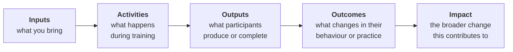

---
learning_outcomes:
  - Articulate a simple theory of change linking activities to outcomes and impact
  - Analyse how context, power, and positionality influence training design and outcomes
  - Identify key assumptions and risks that may affect the success of your training
guiding_questions:
  - What change are you trying to contribute to, and how will training support that?
  - What assumptions are you making about how change will happen?
  - How do your role and positionality influence the design and delivery of this training?
---



In the previous lesson, you mapped the system your training sits within — the actors, resources, constraints, and relationships that will shape whether it succeeds. Now the question is: *how does your training lead to change within that system?*

This lesson helps you articulate the logic of your intended change, surface the assumptions hiding in that logic, and consider how your own position shapes the design.

## Why this matters

A system map shows you what exists. A Theory of Change articulates what you intend. These are related but distinct thinking moves — and separating them matters. Understanding a system doesn't automatically tell you what change is possible or how training can contribute. You need to make that logic explicit.

Hidden assumptions are where training designs quietly fail. If you can't explain *how* your training leads to the change you hope for — step by step, with each link in the chain made visible — then you're designing on faith rather than evidence.

## From system to theory of change

!!! abstract "Theory of Change"
    A Theory of Change is a simple, honest account of the logic connecting what you do to the impact you hope for. It makes your assumptions visible — which is exactly the point.

The basic structure looks like this:

<!-- This chain is deliberately simplified. Lesson 9 revisits assessment of outcomes in more depth. Here we just need readers to grasp the system-level logic. -->

### Building yours step by step

Start from the right side of the chain, not the left. Begin with the impact you hope to contribute to, then work backwards. This keeps you honest — it's easy to list activities you enjoy delivering, but harder to explain exactly how they lead to real-world change.

For each link in the chain, ask: *What has to be true for this step to lead to the next?* Those are your assumptions. Write them down. For example, if your chain says "participants learn data analysis skills → they apply those skills at work," you're assuming they have access to relevant data, that their managers support new approaches, that they are motivated to apply the skills, and that they have time to practice. Each assumption is a potential point of failure.

!!! example "A Theory of Change in action"
    An NGO runs a three-day training on data collection methods for community health workers in rural clinics. Their chain: 
    
    - **Inputs** experienced trainers, mobile devices, sample datasets
    - **Activities** hands-on practice entering and cleaning patient data
    - **Outputs** each participant submits a complete, accurate dataset from their clinic
    - **Outcomes** health workers routinely collect reliable data as part of their workflow
    - **Impact** better data drives better resource allocation across the district

    Their key assumption? That participants will have reliable phone signal and electricity to charge devices back at their clinics. When they surface this assumption, they realise they need to build in an offline-first workflow — and talk to district managers about charging stations *before* the training, not after.

Here is another example: Can you figure out what it's referring to?

You'll return to your Theory of Change throughout this workbook — refining it as you define learning outcomes in Lesson 5, design activities in Lesson 7, and think about assessment in Lesson 9. Treat it as a living document, not a one-off exercise.

## Your role in the system

Training is not neutral. The choices you make as a designer — what to include, whose examples to use, what counts as "good" performance — reflect your position, your background, and your assumptions about what matters.

This isn't a problem to solve; it's a reality to be aware of. Consider the difference between these roles:

| Role | What it looks like | When it fits |
|---|---|---|
| **Instructor** | You set the agenda, deliver content, assess outcomes | When learners need specific technical skills and you have clear expertise |
| **Facilitator** | You guide discussion and create conditions for learning, but participants drive the content | When learners have significant existing knowledge or the topic requires local adaptation |
| **Co-designer** | You build the training *with* participants, not just *for* them | When power dynamics matter, when local context is essential, or when you're an outsider to the community |

Most real training involves a mix of these roles. The key is to choose deliberately rather than defaulting to "instructor" because it's familiar.

!!! question "Pause and reflect"
    Think about a training you've delivered or are planning. What role did you (or would you) naturally take? Who decided the content, the format, the success criteria — and who was left out of those decisions?

## In practice

👉 [Activity 2: Theory of Change](../activities/activity_2_theory_of_change.md) — Build the logical chain from what you do to the impact you hope for, and surface the assumptions hiding in that chain.

## Before you move on

You should now have:

- a draft Theory of Change with assumptions made visible
- a deliberate choice about your role (instructor, facilitator, co-designer, or a mix)

!!! tip "These are living documents"
    Nothing here needs to be final. Training design is iterative — your Theory of Change and role choice will evolve as you work through the rest of this workbook and as you learn more about your learners. Revisit and rework these outputs whenever your thinking shifts.

## Further reading (optional)

- Weiss, C. (1995) — *Nothing as Practical as Good Theory: Exploring Theory-Based Evaluation for Comprehensive Community Initiatives*
  → Supports: Theory of Change linking activities to outcomes and impact
  → Why it matters: explains how making assumptions explicit improves programme design and evaluation
  → Source: [https://www.jstor.org/stable/j.ctt9qg56k](https://www.jstor.org/stable/j.ctt9qg56k)

- Freire, P. (1970) — *Pedagogy of the Oppressed*
  → Supports: positionality, power, and the non-neutrality of education
  → Why it matters: highlights how power relations shape participation and knowledge in learning environments
  → Source: [https://www.penguinrandomhouse.com/books/112874/pedagogy-of-the-oppressed-by-paulo-freire/](https://www.penguinrandomhouse.com/books/112874/pedagogy-of-the-oppressed-by-paulo-freire/)
