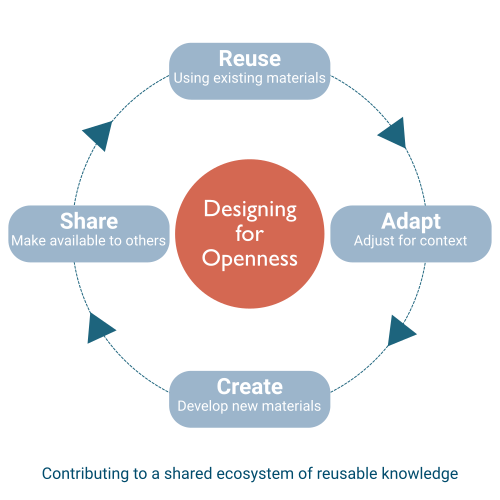

---
learning_outcomes:
  - Explain how designing for openness supports reuse, adaptation, and impact
  - Decide when to reuse, adapt, or create resources
  - Identify key features of reusable and adaptable training materials
  - Recognise hidden assumptions that limit reuse and accessibility
guiding_questions:
  - Can your training be used without you being present?
  - Where could existing resources be reused or adapted?
  - What makes a training resource easy to reuse or modify?
  - What assumptions are embedded in your materials?
---



## Why this matters

In Part 1, you designed your training as a system — understanding your learners and context, defining outcomes, and shaping activities, practice, and feedback.

Now you start working with the resources and materials that will bring that design to life.

You do not need to start from scratch. Effective training is often built through a combination of:

- reusing existing resources  
- adapting resources to your context  
- creating new materials where needed  

This section focuses on how to make those decisions in a practical way.

It is not about getting everything right upfront. It is about making small, deliberate choices that make your materials easier to use, adapt, and improve over time.

In this section, "resources" loosely refers to existing content you may find and use, while "materials" loosely refers to what you design or adapt for your own training.

!!! quote "This section helps you move from..."
    *“Creating everything yourself for a single delivery”*  
    to:  
    *“Using, adapting, and creating resources and materials that can improve and be reused over time.”*

## Core concepts

!!! abstract "Openness as a design choice"
    Openness is a set of practical design decisions that make materials easier to use, adapt, and share over time.

Openness is not something you add at the end. It is reflected in how you structure materials, write instructions, and make assumptions visible so others can understand and use them.

---

!!! abstract "Reuse, adapt, create"
    Training materials can be reused as they are, adapted for a different context, or created from scratch.

Most effective training combines all three. You do not need to commit to one approach — you can choose what makes sense for each part of your training.

---

!!! abstract "Reusable materials"
    Reusable materials are more likely to be understood and used without relying heavily on your explanation.

They do not need to be perfect or complete. They need to be clear enough that someone else (or your future self) can use them with reasonable effort.

---

!!! abstract "Hidden assumptions"
    Materials often include unstated expectations about prior knowledge, tools, or context.

These assumptions are often linked to what you learned in Part 1 about your learners and context. Making them visible makes it easier for others to understand, adapt, and use your materials.

## Practical guidance

### Step 1 — Start with what you already have

Choose one part of your training (an activity, slides, or notes).

Ask:

- What already works well?  
- What would need explanation if someone else used this?  
- What feels unclear or incomplete?  

You do not need to review everything. Start with one example.

---

### Step 2 — Decide how to approach it

For that material, decide how you want to work with it:

- reuse → use it as it is  
- adapt → change parts of it  
- create → build something new  

> What approach is most practical for this part of your training?

- Reuse → when it already fits your needs  
- Adapt → when it is useful but needs changes  
- Create → when nothing suitable exists or adaptation would take more effort  

You can make different choices for different parts of your training.

---

### Step 3 — Improve one element

Make one small, practical improvement:

- clarify instructions  
- make the activity self-contained  
- add missing context (who it is for, what it does)  

Focus on what would make this easier for someone else to use — not on making it perfect.

---

### Step 4 — Make one assumption visible

Identify one hidden assumption, for example:

- prior knowledge  
- required tools or access  
- context-specific examples  

Make it explicit in your material so others can understand and adapt it more easily.

---

### Step 5 — Consider future use

Ask:

- Would this still make sense if I used it again in a few months or in a different context? 
- What would another facilitator need to run this with minimal explanation?  

You do not need full answers yet — this helps you start noticing what supports reuse and improvement over time.

## Example

- **Context:** A trainer has a set of workshop slides they have used multiple times.  
- **Decision:** Should they reuse the slides as they are or make changes?  
- **Action:** They review one activity and realise the instructions rely on what they usually say out loud. They add a short written explanation and clarify the expected output.  
- **Outcome:** The activity becomes easier to run again and could be used by someone else with less explanation.

## In practice

👉 Use [Template 12: OER Workflow](../activities/template_12_oer.md)

Focus on:

- starting a first pass through your material  
- making initial reuse, adaptation, and creation decisions  

Include:

- **what to do:** Review one part of your training and decide what to reuse, adapt, create, or clarify  
- **focus sections:** 0 (Context), 2 (Design Decisions)  
- **expected output:** A first set of documented decisions about how you will work with this material  
- **approximate time:** 20–30 minutes  

---

👉 Revisit [Template 12: OER Workflow](../activities/template_12_oer.md)

Include:

- **what to do:** Refine your decisions after improving one element of your material  
- **expected output:** An updated set of decisions that reflect what you learned through small changes  
- **approximate time:** 10–15 minutes  

---

👉 Revisit [Template 8: Learning Activity Design](../activities/template_8_activity_design.md)

Include:

- **what to do:** Improve one activity so it can be used with minimal additional explanation  
- **expected output:** A clearer, more reusable, and self-contained activity  
- **approximate time:** 10–15 minutes  

---

### Suggested process

**Step 1 — Select one example**  
Choose a small, manageable part of your training.

**Step 2 — Make initial decisions**  
Decide whether to reuse, adapt, or create.

**Step 3 — Improve clarity**  
Make one targeted improvement.

**Step 4 — Update your decisions**  
Capture what changed and why in Template 12.

## Key takeaways

!!! tip "Key takeaway"
    You do not need to redesign everything — small, focused improvements can make your materials easier to reuse and adapt.

!!! tip "Key takeaway"
    Designing for openness starts with clarity. As your materials become clearer, they also become easier to improve and reuse over time.

## Before you move on

At this point, you should have:

- at least one example of a resource you have reviewed  
- an initial decision to reuse, adapt, or create  
- one small improvement that makes a resource easier to use without you  
- one assumption made visible  

These are starting points. You will revisit and refine them as you work through the rest of this module.

## Further reading (optional)

- Wiley, D. (2014) — *The Access Compromise and the 5th R*  
  → Supports: reuse and adaptation in open education  
  → Why it matters: explains how openness enables meaningful reuse  
  → Source: https://opencontent.org/blog/archives/3221  

- UNESCO (2019) — *Recommendation on Open Educational Resources*  
  → Supports: openness and reuse  
  → Why it matters: defines principles for making materials accessible and adaptable  
  → Source: https://www.unesco.org/en/legal-affairs/recommendation-open-educational-resources-oer  

- Hodgkinson-Williams, C., & Trotter, H. (2018) — *A social justice framework for understanding OER adoption*  
  → Supports: context and accessibility  
  → Why it matters: highlights how context shapes reuse and adaptation  
  → Source: https://www.roarmap.org/wp-content/uploads/2018/04/hodgkinson-williams_trotter_oer_adoption.pdf  