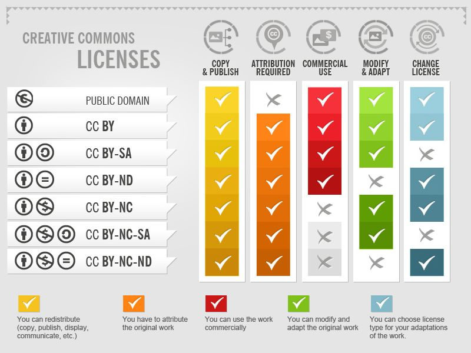

---
learning_outcomes:
  - Explain how open licenses enable reuse, adaptation, and sharing of training resources
  - Distinguish between different Creative Commons license types and their implications
  - Make informed decisions about how to license your own materials
  - Apply correct and consistent attribution when reusing or adapting OER
  - Identify risks when combining or adapting differently licensed resources
guiding_questions:
  - 'What does "open" allow you to do in practice?'
  - How do different licenses affect reuse and adaptation?
  - What license should you choose for your materials?
  - How do you correctly attribute reused content?
  - What problems arise when combining resources with different licenses?
---



## Why this matters

In the previous section, you identified and evaluated resources and made initial decisions about what to reuse, adapt, or create.

Now you need to check what is **actually possible with those resources**.

Many useful resources are available online, but access does not always mean permission. Licensing affects:

- whether you can modify a resource  
- whether you can combine it with others  
- whether others can reuse your materials  

This may influence your earlier decisions. Some resources you selected may need to be adapted differently — or created from scratch.

You do not need to master licensing in detail. You need enough understanding to make **practical, confident choices**. This is not about limiting your choices — it helps you make better ones.

!!! quote "This section helps you move from..."
    *"This resource looks useful"*  
    to:  
    *"I understand what I can do with it — and how others can use my work"*

## Core concepts

!!! abstract "Licenses"
    A license defines what you are allowed to do with a resource.

By default, most resources are not openly reusable. A license makes permissions explicit — for example, whether you can reuse, modify, or share a resource.

---

!!! abstract "Open licenses"
    Open licenses are designed to make reuse, adaptation, and sharing possible.

They allow you to use and build on existing resources without needing to request permission each time.

---

!!! abstract "Creative Commons elements"
    Creative Commons (CC) licenses use a small set of conditions to communicate permissions clearly.

The main elements are:

- **BY (Attribution)** → you must credit the creator  
- **SA (ShareAlike)** → adaptations must use the same license  
- **NC (NonCommercial)** → cannot be used commercially  
- **ND (NoDerivatives)** → cannot be modified  

These combine into common licenses such as:

- **CC BY** → most open (reuse, adapt, share with attribution)  
- **CC BY-SA** → must share adaptations under same license  
- **CC BY-NC** → reuse and adapt, but not for commercial use  
- **CC BY-ND** → reuse allowed, but no changes  

You do not need to memorise all combinations — focus on what affects how you plan to use a resource.

---

!!! abstract "License compatibility"
    When combining resources, their licenses must not conflict.

For example:

- ND (NoDerivatives) resources cannot be adapted  
- SA (ShareAlike) requires you to apply the same license  
- NC (NonCommercial) limits how resources can be used  

Compatibility does not need to be perfect — it needs to be clear enough that your materials can be used without legal or practical conflicts.

---

*Source: [Creative Commons Licenses](https://foter.com/blog/how-to-attribute-creative-commons-photos/#more-4) by Foter ([CC BY-SA](https://creativecommons.org/licenses/by-sa/4.0/))*

---

!!! abstract "Attribution"
    Attribution is how you credit the original creator when you reuse or adapt a resource.

A simple approach is:

- author  
- title  
- source  
- license  

Clear attribution supports reuse, transparency, and trust.

## Practical guidance

### Step 1 — Identify the license

For each resource:

- find the license statement  
- note the type (e.g. CC BY, CC BY-SA)  
- check whether it is clearly stated  

If no license is visible, treat the material as **not openly reusable** and consider alternatives.

---

### Step 2 — Focus on what matters for your use

Ask a few practical questions based on how you plan to use the resource:

- Can I modify this material?  
  → (ND means no)  

- Can I combine it with other resources?  
  → (SA may affect this)  

- Can it be used in my context?  
  → (NC may limit some uses)  

You do not need to interpret every detail. Focus on what affects your intended use.

---

### Step 3 — Check combinations

If you are using multiple resources:

- check whether their licenses can work together  
- look for potential conflicts  

> What should you do if there is a conflict?

- Replace one resource with another that has compatible licensing or create one from scratch
- Simplify your design  
- Keep resources separate instead of combining  

These are design choices. Choose what is most practical for your context.

---

### Step 4 — Choose a license for your materials

> How open do you want your materials to be?

- More open (e.g. CC BY) → easier for others to reuse and adapt  
- More controlled (e.g. NC or SA) → more conditions on reuse  

Choose based on:

- your goals for reuse  
- your context and stakeholders  
- how you expect others to use your materials  

There is no single correct choice — focus on what supports your intended use.

---

### Step 5 — Add attribution

When reusing or adapting:

- include author, title, source, and license  
- keep attribution visible and consistent  

Clear attribution helps others understand where materials come from and supports reuse and adaptation.

## Example

- **Context:** A trainer is combining two OER resources into one workshop.  
- **Decision:** Can both resources be adapted and combined?  
- **Action:** They identify that one resource has a CC BY-ND license, which does not allow modification. Since adaptation is needed, they replace it with a CC BY resource.  
- **Outcome:** The final material can be adapted and reused more easily, supporting future use.

## In practice

👉 Use [Activity 14: OER Workflow](../activities/activity_14_oer.md)

Focus on:

- checking what is allowed for the resources you selected  
- updating your earlier reuse and adaptation decisions  

Include:

- **what to do:** Identify the license for each selected resource and note what is allowed (reuse, adapt, combine)  
- **focus sections:** 1 (Find and Evaluate Resources), 2 (Design Decisions)  
- **expected output:** An updated set of licensing constraints and decisions for each resource  
- **approximate time:** 20–30 minutes  

---

👉 Revisit [Activity 14: OER Workflow](../activities/activity_14_oer.md)

Include:

- **what to do:** Check whether selected resources can be combined without conflicts and adjust your plan if needed  
- **expected output:** A set of resources that can be used together, or clear decisions about what to create or keep separate  
- **approximate time:** 10–15 minutes  

---

### Suggested process

**Step 1 — List your resources**  
Write down selected resources and their licenses.

**Step 2 — Identify key conditions**  
Note BY, SA, NC, ND elements.

**Step 3 — Review decisions**  
Adjust reuse/adapt/create choices if needed.

**Step 4 — Check combinations**  
Ensure your materials can work together or revise your approach.

## Key takeaways

!!! tip "Key takeaway"
    You do not need to understand every detail of licensing — focus on what affects how you reuse, adapt, and combine materials.

!!! tip "Key takeaway"
    Licensing helps you make better decisions about what is possible and how your materials can be used by others.

## Before you move on

At this point, you should have:

- a list of resources with identified licenses  
- a clearer understanding of key permissions (BY, SA, NC, ND)  
- updated decisions about reuse, adaptation, or creation  
- a plan for including attribution in your materials  

These decisions may change as you adapt your materials. The goal is to make choices that are clear enough to move forward.

## Further reading (optional)

- Creative Commons (n.d.) — *About The Licenses*  
  → Supports: understanding license types and permissions  
  → Why it matters: provides authoritative guidance on how licenses work  
  → Source: https://creativecommons.org/licenses/  

- Wiley, D. (2014) — *The Access Compromise and the 5th R*  
  → Supports: reuse and adaptation in open education  
  → Why it matters: explains how openness enables meaningful reuse  
  → Source: https://opencontent.org/blog/archives/3221  

- UNESCO (2019) — *Recommendation on Open Educational Resources*  
  → Supports: global OER policy and principles  
  → Why it matters: defines frameworks for equitable access and reuse  
  → Source: https://www.unesco.org/en/legal-affairs/recommendation-open-educational-resources-oer  