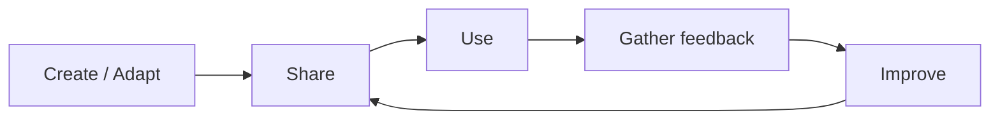

---
learning_outcomes:
  - Describe the OER lifecycle and identify where your materials sit within it
  - Identify realistic approaches to maintaining and updating materials
  - Collect and use feedback to make targeted improvements
  - Make practical decisions about when to update, maintain, or retire materials
guiding_questions:
  - What happens to materials after they are shared?
  - What feedback is worth collecting and acting on?
  - How much maintenance is realistic for your situation?
  - When should you stop maintaining a resource?
---



Your materials are shared. They are out in the world — on a repository, a website, a shared drive, or a platform where others can find and use them.

Now what?

This is the question most OER guidance skips. There is plenty of advice about creating and sharing resources, but surprisingly little about what comes after. In practice, "after sharing" is where the real value of open materials is either realised or lost.

## Why this matters

Shared materials do not stay useful by default. Over time, links break, tools change, examples become dated, and new contexts expose gaps that the original design did not anticipate. A workshop built around a specific software version becomes misleading when the interface changes. Case studies that were current two years ago may reference policies or data that have since been superseded.

This does not mean every resource needs constant attention. Some materials have a long shelf life; others become outdated quickly. The question is not "should I maintain everything?" but "what level of attention is realistic and worthwhile for this particular resource?"

Getting this right matters because unmaintained materials do not just sit quietly. They continue to be found, used, and relied upon — and when they mislead or confuse, they erode trust in both the resource and in open educational practice more broadly.

## The OER lifecycle

Open materials exist within a cycle, not a pipeline. They are not "done" when they are published — they continue to be used, evaluated, and improved.

Each time materials are used in a real context, new information emerges: what works, what confuses, what is missing, what has become outdated. This feedback — whether you actively collect it or simply notice it — is what makes the difference between materials that improve over time and materials that quietly degrade.

Not every resource needs to go through this cycle frequently. Some resources stabilise quickly and need only occasional review. Others, especially those tied to fast-changing tools or contexts, benefit from more active attention. The cycle is a framework for thinking about maintenance, not a requirement for constant revision.

## Collecting meaningful feedback

The most important decision about feedback is not *how much* to collect but *what kind*. Feedback that leads to action is valuable. Feedback that sits in a form unread is wasted effort — yours and the respondent's.

### What to listen for

Focus on feedback that reveals how materials perform in real use:

**Where learners struggle or disengage.** This is the most actionable signal. If multiple facilitators report that learners get stuck at the same point, that section needs attention — clearer instructions, a worked example, or a restructured activity.

**What facilitators need to adjust on the fly.** When a facilitator consistently has to add explanation, skip a section, or modify an activity during delivery, the materials have a gap. These adjustments are adaptation signals that should flow back into the resource.

**What does not transfer across contexts.** A resource that works well in one setting but fails in another reveals hidden assumptions. These are exactly the kind of assumptions you learned to surface in Lesson 1 — now you are finding them through use rather than review.

### How to collect it

Match your feedback approach to your capacity and your users:

- **After your own deliveries** — note what you had to explain, skip, or change. This requires no extra infrastructure, just a habit of reflection.
- **From other facilitators** — if others use your materials, a short set of focused questions (3–5) after delivery is more useful than a long survey. Ask what they changed and why.
- **From learners** — direct learner feedback on materials (as opposed to the training experience) is most useful when it focuses on clarity and usability: "Was anything confusing?" "Were the instructions clear enough to follow?"

!!! warning "Avoid feedback theatre"
    Collecting feedback you will never act on is worse than collecting none. If you do not have capacity to review and respond to feedback, say so. It is better to plan a single review point (e.g., "I will review feedback after the next three deliveries") than to continuously collect data you never use.

## Deciding your maintenance approach

Not all materials warrant the same level of attention. Be honest about your capacity and the resource's importance.

**Active maintenance** means you regularly review and update the resource — after each delivery, on a schedule, or in response to feedback. This makes sense for materials that are widely used, tied to fast-changing content (tools, policies, data), or central to your work.

**Occasional updates** means you revise when a clear need arises — a broken link, an outdated example, feedback that reveals a persistent problem. This is realistic for most resources. It does not require a schedule, just a willingness to revisit when prompted.

**Archiving** means you stop updating the resource but keep it available with a clear note about its status. This is a valid choice for materials that have been superseded, that serve a very specific past context, or that you no longer have capacity to maintain. An archived resource with a clear note (*"Last updated March 2024. No longer actively maintained."*) is more honest and useful than a resource that appears current but is not.

!!! question "What level fits your situation?"
    Consider: How often is this resource used? By how many people? How quickly does the content change? How much time can you realistically spend on maintenance? Your answers will point toward active, occasional, or archive — and the right answer may change over time.

## Making targeted improvements

When you do update, focus on changes that make the biggest difference. Not everything that could be improved needs to be improved right now.

Prioritise changes that address recurring problems — the same confusion reported by multiple users, the same section that facilitators consistently skip or modify. These patterns indicate structural issues worth fixing, not one-off preferences.

Distinguish between **corrections** (fixing something that is wrong — a broken link, an inaccurate claim, unclear instructions) and **enhancements** (adding something new — a better example, additional scaffolding, an alternative activity). Corrections are usually urgent and low-effort. Enhancements can be batched and planned.

When you make changes, track them. A simple versioning approach keeps you and your users oriented:

- **What changed** — a brief description of the updates
- **Why it changed** — the feedback or observation that prompted the change
- **Which version is current** — a version number, date, or both

You do not need a sophisticated version control system. A changelog at the top of a document, a version number in the filename, or a dated entry in a README file is enough. The point is that someone encountering your materials can tell whether they have the latest version and what has changed since the last one.

## Knowing when to stop

Not every resource should be maintained indefinitely. There are valid reasons to retire materials:

- The content is no longer accurate or relevant, and updating would amount to a full rewrite
- A better resource now exists that serves the same purpose
- The context the resource was designed for no longer exists
- You no longer have the capacity or expertise to maintain it

Retiring a resource is not failure — it is honest stewardship. If you archive a resource, add a note explaining its status and, where possible, point to a replacement. This helps users who find the archived version understand that it is no longer current and where to look instead.

## In practice

👉 Use [Activity 14: OER Workflow](../activities/activity_14_oer.md) — plan how you will sustain and improve your materials

Work through Section 5 (Sustainability and Improvement). Define your feedback approach, choose a maintenance level, and set up a simple versioning approach.

- **what to do:** Define how you will collect feedback, what maintenance level is realistic, and how you will track changes over time
- **focus sections:** 5 (Sustainability and Improvement)
- **expected output:** A sustainability plan covering feedback collection, maintenance level, and versioning approach
- **approximate time:** 20–30 minutes

## Before you move on

You should now have:

- a realistic plan for how feedback will inform improvements
- a defined maintenance approach (active, occasional, or archive) with reasoning
- a simple versioning method for tracking changes
- a clearer sense of what "sustainable" means for your specific materials and capacity

These plans are working documents. Adjust them as your materials are used and as your circumstances change.

## Further reading (optional)

- Wiley, D., & Hilton, J. (2018) — *Defining OER-enabled pedagogy*
  → Supports: iterative improvement through open practice
  → Why it matters: connects openness to continuous improvement, arguing that the value of OER comes through use and adaptation, not just publication
  → Source: https://opencontent.org/blog/archives/5009

- Atenas, J., Havemann, L., & Timmermann, C. (2020) — *Critical literacies for open educational practices*
  → Supports: reflective, sustainable engagement with OER
  → Why it matters: highlights that sustaining open materials requires ongoing critical reflection about context, power, and purpose
  → Source: https://doi.org/10.5334/jime.576
